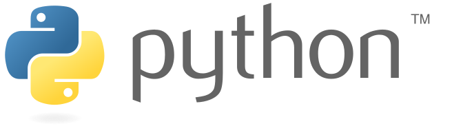
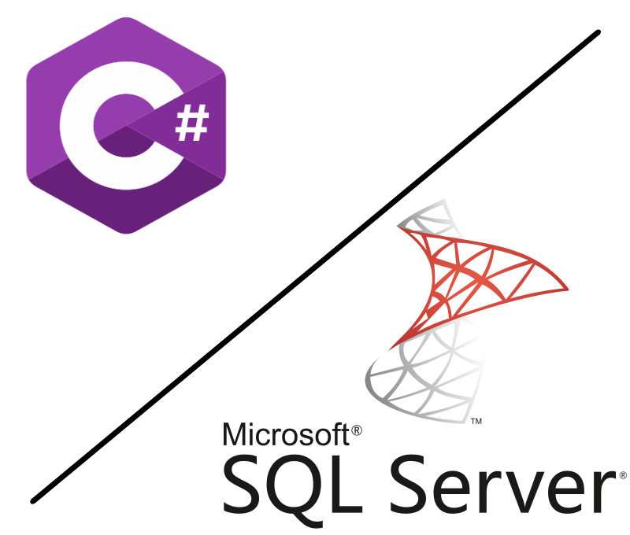
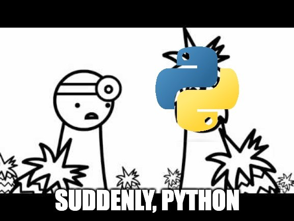
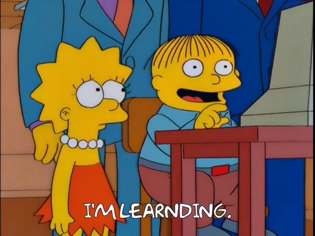
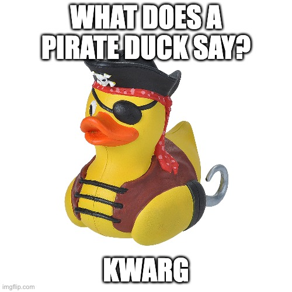
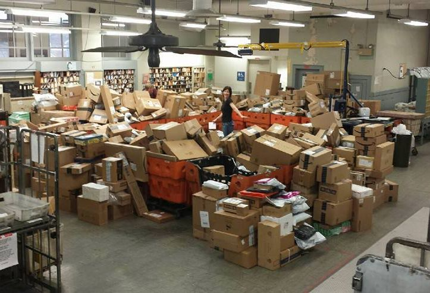

<!-- _paginate: false -->

# Python

## Past, Present & Future

`@<George Verney>, @<Louis Feather> & @<Will Johnson>`

---


# Python in the Past

Lightweight history of Python.

`@<George Verney>`

---


# What is Python?

Python is a high-level, general-purpose programming language.

---

<style scoped>
    header, footer {
        display: none;
    }
</style>

<!-- _paginate: skip -->


---

<style scoped>
    header, footer {
        display: none;
    }
</style>

<!-- _paginate: skip -->


---


# Philosophy

the language's core ~~manifesto~~ philosophy is summarized in the document _"The Zen of Python"_ (PEP 20), which includes aphorisms such as:

- Beautiful is better than ugly.
- Explicit is better than implicit.
- Simple is better than complex.
- Complex is better than complicated.
- Readability counts.

**TS; RE** ```python -c import this```

---

<!-- _class: center -->

# A \[Very\] Brief History

---


## ~~What~~ Who is Python?

Python was conceived by a Dutch chap called **_Guido van Rossum_** (him 👉) way back in the \[late\] 1980s as a successor to the ABC programming language.

Guido began the implementation solo in 1989.

---


> Python really is sort of the next version of ABC with all the things that were great about ABC retained, and all the things I thought were not so successful in ABC removed...

~ _Guido (probably)_

P.S. the language was named after **Monty Python's Flying Circus**!

---


## Python 0.9

Python's first public release was `1991-02-20` (which pretty ancient for a programming language.).

> This is Python, an extensible interpreted programming language that combines remarkable power with very clear syntax.
>
> This is version 0.9 (the first beta release), patchlevel 1.

<sub>_Source: <https://www.tuhs.org/Usenet/alt.sources/1991-February/001749.html>_</sub>

---


## Python 1.0

### Released 1994-01-26

I don't know...

...I wasn't writing code quite yet!

<sub>_I was 7 years old._</sub>

---


## Python 2.0

### Released 2000-10-16

Sunsetted `2020-01-01`

> **Never 2.** Shedders don't let Shedders use Python 2.

~ _TDS Engineering Handbook_

<!-- Introduced things such as:

- Improved OS support for Mac and Windows 💻
- List Comprehension 🎡
- Named and keyword argument unpacking e.g. `f(*args, **kw)`
- Import renaming/aliasing e.g. `import name as othername`
- Introduction of `IndentationError` 🙌 -->

---


## Python 3.0

### Released 2008-12-03

This is the current _major version_ of the language.

> I think that, honestly, the mistake that all us of in the Python core and actually the whole Python community, the mistake we made was underestimating Python's popularity.

~ _Guido (again), innit_

<!-- - there's a reason dynamic typing proves so popular.
- there's a reason both JavaScript and Python have introduced typing.
- there's probably a reason they're leaving it optional too... -->

---

## What Version to Use

If in doubt, use **3.9** (latest supported across AWS, Azure and GCP).

<sub>Latest stable release (correct at the time of writing) is 3.11.4.</sub>

---



# Python in the Present

Present day Python from a total newbie's perspective.

`@<Louis Feather>`

---



# My ~~Python~~ History

- Just 12 months ago I knew **NO** Python.
- I had **NEVER** used it before.
- My background was **Microsoft** using C# and SQL Server.

---



# Then...

I'm thrust onto a project where we're using Python (and only the standard library).

I was ripped from my cosy, capitalist Microsoft bubble.

---


# Installation

Literally the worst.

- Clean M1 Mac
- Conflicts with pre-installed Python
- Packages and other bits not working on M1
- Updates required to XCode Command Line Tools
- Homebrew got buggered
- Fudging `~/.zshrc` with environment variables

This part of the process still **SUCKS** in my opinion. It shouldn't take me half a day to fix all this crap.

---

# Learning

Using Python for the first time meant **A LOT** of learning. Here's some of the stuff I learned...

---


## Syntax

- No curly braces!
- No semi-colons!
- WHERE IS THE MIS-INDENTED LINE?!

---

## Importy Stuff

The process of importing my first module:

1. That module definitely exists.
1. That module most definitely exists.
1. THE MODULE MOST DEFINITELY EXISTS YOU STUPID THING.
1. Oh, the `init` file only has one `_` at the start...

---

## Unit Test Mocking

This took me bloody ages but was an absolute saviour.

Definitely one of those things where reading doesn't help too much.

Thanks to George for spending hours sitting with me and helping me learn this.

Eventually one day, it clicks.

---


## Virtual Environments

Make sure you do all of your tinkering in a `venv`.

I learnt this the hard way.

---


## List Comprehension

This feature is ace!

It's like _Linq_ but miles easier to remember how to do.

Great for grabbing things from lists (and stuff) without having loops all over.

---



## `*args` and `**kwargs`

Pretty much swallows up arguments that aren't declared as positional arguments.

**SUPER** useful for creating instances of _model_ objects when you're reading in data.

---

# Where am I now?

What are my thoughts on _**the old snake**_ now?

---


## Installation

Mentioned before but this bit sucks.

Would maybe put me off using Python if was a complete beginner.

---



## A Package for Everything

No matter what you need, there's a package for it... that's great!

Whether they're any good or not, different question.

Having `pip` and access to whole world of stuff is great.

Don't reinvent the wheel!

---


## Rapid Development

Once it's installed, Python is super quick to start developing with.

It's great for fiddling with things or if you need to write a quick script to automate a rubbish task or something.

Much more lightweight than `C#`.

---

# Le Conclusion

- I am a Python convert
- It's only becoming more popular
- Coding classes that used to teach Java are now teaching Python
- There genuinely is (or seems to be) a package for everything
- It does not take long to pick up this language
- Installing Python is so bad

---

# The Future of Python

A look at what's in store for Python

`@<Will Johnson>`


---

# Usage

Python is still growing in popularity.

Wide variety of uses:

- Data processing
- AI and ML
- Education
- Web and APIs
- Web scraping
- Game development
- IoT / Raspberry Pi
- Scientific computing


---

# Education

Why is it the go to language in the classroom?

- Simple to read
- Versatile
- A package for everything!
- Used after education


---

# Python 4?

Guido doesn't think it's likely.

2 to 3 was such a pain that it will be avoided at all costs.

Underlying changes to C under the hood might force it in the far future though.


<sub>_source: [Q&A with Guido van Rossum, Inventor of Python
](https://www.youtube.com/live/aYbNh3NS7jA?feature=share&t=2872)_</sub>

---

# Looking Forward

- Here to stay
- PyData
- Get learning!


---

<style scoped>
    header, footer {
        display: none;
    }
</style>

<!-- _paginate: skip -->


